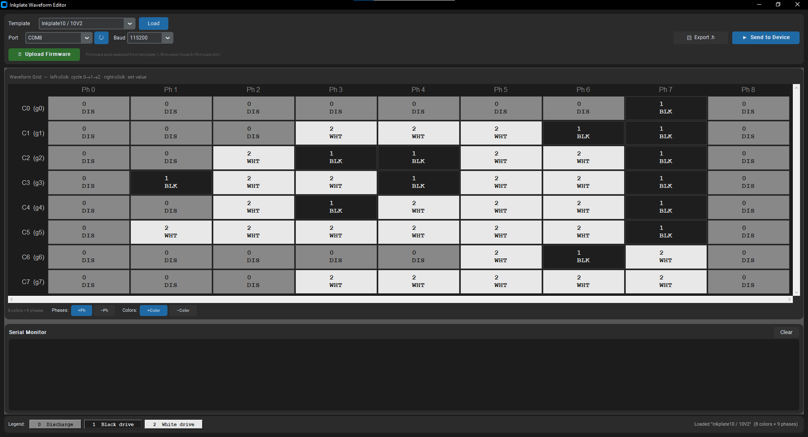

# Inkplate Waveform Configurator

[](https://github.com/JosipKuci/Inkplate-waveform-configurator/actions/workflows/build-waveform-editor.yml)

A desktop GUI tool for creating, editing, and sending custom EPD waveforms to Soldered Inkplate e-paper displays. Fine-tune how each grayscale level drives the e-paper panel, then push the waveform to your device over serial — no recompilation needed.

---

## Screenshot

<!-- TODO: add screenshot here -->


---

## Features

- **Visual waveform grid** — click cells to cycle between Discharge / Black drive / White drive, or right-click for a context menu
- **Built-in templates** for all supported Inkplate models, ready to load and tweak
- **Add / remove phases and color levels** — up to 16 × 16
- **Send to device over serial** — transmits the waveform to a running Inkplate_Custom_Waveform sketch in one click
- **Export as C header** — generates a `customWaveform` array ready to paste into Arduino code
- **One-click firmware upload** — flashes the bundled Inkplate_Custom_Waveform firmware directly from the app via esptool; no Arduino IDE needed
- **Built-in serial monitor** — shows TX / RX traffic and upload progress in real time
- **Dark theme** UI built with customtkinter

---

## Supported Models

| Template name | Colors | Phases |
|---|---|---|
| Inkplate4TEMPERA | 8 | 9 |
| Inkplate5 | 8 | 9 |
| Inkplate5V2 | 8 | 9 |
| Inkplate6 / 6V2 | 8 | 9 |
| Inkplate6FLICK | 8 | 9 |
| Inkplate6PLUS / 6PLUSV2 | 8 | 9 |
| Inkplate10 / 10V2 | 8 | 9 |

Blank templates are also included: **Empty (8×9)** for standard 3-bit panels and **Empty 4-bit (16×9)** for 4-bit panels.

---

## Download & Install

Pre-built executables are attached to every [release](https://github.com/JosipKuci/Inkplate-waveform-configurator/releases). Bundled firmware for all supported models is included — no separate installation required.

### Windows

1. Download `waveform-editor-windows.exe` from the latest release.
2. Double-click to run. Windows SmartScreen may warn on first launch — click **More info → Run anyway**.

### Linux

1. Download `waveform-editor-linux.tar.gz` from the latest release.
2. Extract and run:
   ```bash
   tar -xzf waveform-editor-linux.tar.gz
   chmod +x waveform_editor
   ./waveform_editor
   ```

### macOS

> **Important:** The macOS executable is not code-signed. macOS will block it by default.

1. Download `waveform-editor-macos.tar.gz` from the latest release.
2. Extract the archive:
   ```bash
   tar -xzf waveform-editor-macos.tar.gz
   ```
3. Remove the quarantine attribute so macOS allows it to run:
   ```bash
   xattr -cr waveform_editor
   ```
4. Make it executable and launch:
   ```bash
   chmod +x waveform_editor
   ./waveform_editor
   ```

   Alternatively, after extracting you can **right-click → Open** in Finder and click **Open** in the dialog that appears.

---

## Building from Source

### Prerequisites

- Python 3.10 or newer
- `pip`
- Git

### 1. Clone the repository

```bash
git clone https://github.com/JosipKuci/Inkplate-waveform-configurator.git
cd Inkplate-waveform-configurator
```

### 2. Create a virtual environment

Using a virtual environment keeps dependencies isolated from your system Python.

**Linux / macOS:**
```bash
python3 -m venv .venv
source .venv/bin/activate
```

**Windows (PowerShell):**
```powershell
python -m venv .venv
.\.venv\Scripts\Activate.ps1
```

**Windows (Command Prompt):**
```cmd
python -m venv .venv
.venv\Scripts\activate.bat
```

### 3. Install dependencies

```bash
pip install -r requirements.txt
```

| Package | Purpose |
|---|---|
| `customtkinter` | Modern dark/light GUI framework (required) |
| `pyserial` | Serial port communication — "Send to Device" disabled without it |
| `esptool` | ESP32 firmware flashing — "Upload Firmware" disabled without it |

### 4. Run

```bash
python waveform_editor.py
```

### 5. Build a standalone executable with PyInstaller

To produce a single-file executable (mirrors what the CI workflow does):

```bash
pip install pyinstaller
pyinstaller waveform_editor.spec
```

The output is placed in `dist/`. The `firmware/` directory is automatically bundled inside the executable via `waveform_editor.spec`.

---

## How It Works

### Waveform grid

An EPD waveform defines how each grayscale level (color) drives the panel across a sequence of time steps (phases). Each cell in the grid holds one of three drive values:

| Value | Meaning | Color in editor |
|---|---|---|
| `0` | Discharge — panel voltage released | Gray |
| `1` | Black drive — pushes pixel toward black | Dark |
| `2` | White drive — pushes pixel toward white | Light |

Left-click a cell to cycle `0 → 1 → 2 → 0`. Right-click to set an exact value from a context menu.

Use **+Ph / −Ph** to add or remove phase columns (max 16) and **+Color / −Color** to add or remove grayscale rows (max 16).

### Sending a waveform to your device

1. Flash the bundled firmware to your Inkplate using the **Upload Firmware** button (select the matching template first — the app picks the correct `firmware/<board>/firmware.bin` automatically).
2. After flashing, select the correct serial port and baud rate (default `115200`).
3. Click **Send to Device**. The waveform is transmitted over serial and applied immediately.

### Exporting as C header

Click **Export .h** to save a `customWaveform` array as a C header file, ready to include in an Arduino sketch.

### Firmware upload

The app bundles the Inkplate_Custom_Waveform firmware for every supported model under `firmware/<board>/firmware.bin`. When **Upload Firmware** is clicked, the app invokes esptool internally (no terminal needed) and streams progress to the built-in serial monitor.

---

## Serial Protocol Reference

The waveform is sent as a single newline-terminated ASCII string:

```
TS;<colors>;<phases>;<v00>;<v01>;...;<vNM>;TE\n
```

| Field | Description |
|---|---|
| `TS` | Transmission start marker |
| `<colors>` | Number of grayscale levels (rows) |
| `<phases>` | Number of phases (columns) |
| `<vRC>` | Cell value at row R, column C — `0`, `1`, or `2` |
| `TE` | Transmission end marker |

Example for a 2-color × 3-phase waveform:

```
TS;2;3;0;1;2;2;1;0;TE
```

---

## License

See [LICENSE](LICENSE).
